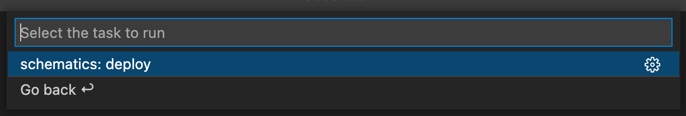

# Getting started with IBM Cloud Schematics extension for Visual Studio Code

IBM Cloud Schematics extension for Visual Studio Code aids in automating your IBM Cloud infrastructure, service, and application stack across cloud environments from VS Code editor.

**In this article, you will learn how to:**

-   Deploy a new Terraform template to IBM Cloud Schematics from the VS Code editor
-   Clone an existing Schematics workspace from IBM Cloud
-   Clone a Terraform Git repository and deploy it to IBM Cloud Schematics
-   Perform additional tasks on the deployed template using the VS Code command palette

**Prerequisites:**

-   Terraform: [Install and configure Terraform](https://learn.hashicorp.com/tutorials/terraform/install-cli#install-terraform) – You will need a local copy of Terraform to integrate your local development environment
-   GIT: [Install GIT CLI](https://git-scm.com/downloads)
-   Visual Studio Code: Install the version of [Visual Studio Code](https://code.visualstudio.com/download) that is appropriate for your machine

## Install IBM Cloud Schematics Visual Studio Code extension

1. Go to [Releases](https://github.com/IBM-Cloud/vscode-ibmcloud-schematics/releases)
2. In the Assets section, click on the file `ibmcloud-schematics-<version>.vsix`. This will download the file to your machine
3. Launch Visual Studio Code and open a new Terminal
4. In the new opened terminal in VS Code run the command `code --install-extension <path to downloaded vsix file from step 2>`

## Verify the IBM Cloud Schematics extension is installed in Visual Studio Code

1. Select Extensions menu
2. Enter “@installed IBM Cloud Schematics” in the search text box
3. The IBM Cloud Schematics extension will appear in the list of installed extensions

## Tutorial 1: Iteratively develop, deploy, and test a new Terraform template on IBM Cloud Schematics

For the sake of this tutorial, I we will use [VPC Classic Cluster](https://github.com/IBM-Cloud/terraform-provider-ibm/tree/master/examples/ibm-cluster/vpc-classic-cluster) as an example to deploy to IBM Cloud Schematics, but you are free to use any Terraform template. You can find some useful examples in the on terraform-provider-ibm repository.

1. Download the terraform template from https://github.com/IBM-Cloud/terraform-provider-ibm/tree/master/examples/ibm-cluster/vpc-classic-cluster to your machine
2. Launch Visual Studio Code
3. Open the downloaded template from step one into editor from File > Open...
4. Select Terminal > Run Task... , this will open VS Code Tasks dropdown
5. In the VS Code Tasks search text box , search for `ibmcloud-schematics`
   
6. You will see 3 tasks as in above image
7. Select ibmcloud-schematics-build > schematics: build. This will validate the terraform configuration and output `Success! The configuration is valid on the terminal`
   
8. Select Terminal > Run Task... now select ibmcloud-schematics-deploy > schematics: deploy from the dropdown
   
9. Select target API to deploy. Here select cloud.ibm.com from the picker
   
10. Enter API key. Type in your cloud.ibm.com API key and hit enter
    
11. Select Terraform version of workspace. Here select `terraform_v0.12`
    
12. You can see the deployment progress on the terminal. Finally you should be seeing successful deploy as in below screenshot
    

## Tutorial 2: Iteratively develop the existing Terraform template in the Schematics workspace

You can clone your existing Schematics workspace using the Schematics workspace ID.

1. Launch Visual Studio Code
2. Select Terminal > Run Task... , this will open VS Code Tasks dropdown
3. In the VS Code Tasks search text box , search for `ibmcloud-schematics`
   
4. Select ibmcloud-schematics-build > schematics:clone
   
5. Select the folder where you want to clone Schematics workspace
6. Type the Schematics workspace ID in the displayed text box
   
7. Select target API to deploy. Here select cloud.ibm.com from the picker
   
8. Enter the API key. Type in your cloud.ibm.com API key and hit enter
   
9. A new VS Code window will open with the cloned Schematics workspace

## Tutorial 3: Iteratively develop an existing Terraform template from a Git repository for IBM Cloud Schematics

For sake of this tutorial, I will use [VPC Cluster](https://github.com/Cloud-Schematics/vpc-cluster) as an example to clone in VS Code

1. Launch Visual Studio Code
2. Select Terminal > Run Task... , this will open VS Code Tasks dropdown
3. In the VS Code Tasks search text box , search for “ibmcloud-schematics”
4. Select ibmcloud-schematics-build > schematics:clone
   
5. Select the folder where you want to clone https://github.com/Cloud-Schematics/vpc-cluster
6. Enter https://github.com/Cloud-Schematics/vpc-cluster and hit enter
   
7. A new VS Code window will open with the cloned https://github.com/Cloud-Schematics/vpc-cluster
8. Select Terminal > Run Task... , this will open VS Code Tasks dropdown
9. In the VS Code Tasks search text box , search for “ibmcloud-schematics”
   
10. Select ibmcloud-schematics-build > schematics:build. This will validate the terraform configuration and output “Success! The configuration is valid on the terminal”
    
11. Select Terminal > Run Task... now select ibmcloud-schematics-deploy > schematics:deploy from the dropdown
    
12. Select target API to deploy. Here select cloud.ibm.com from the picker
    
13. Enter API key. Type in your cloud.ibm.com API key and hit enter
    
14. Select Terraform version of workspace. Here select terraform_v0.12
    
15. You can see the deployment progress on the terminal. Finally you should be seeing a successful deploy as in below screenshot
    

## Tutorial 4: A palette of VS Code commands for IBM Cloud Schematics

The IBM Cloud Schematics extension provides additional commands that can be executed to perform workspace specific tasks from editor. Below are the commands provided by the extension:

-   IBM Cloud Schematics workspace: Apply
-   IBM Cloud Schematics workspace: Plan
-   IBM Cloud Schematics workspace: View jobs
-   IBM Cloud Schematics workspace: View log
-   IBM Cloud Schematics workspace: View latest log
-   IBM Cloud Schematics workspace: View resources
-   IBM Cloud Schematics workspace: View variables
-   IBM Cloud Schematics workspace: Pull latest
-   IBM Cloud Schematics workspace: Destroy resources
-   IBM Cloud Schematics workspace: Delete

## Tutorial 5: Migrate an existing Terraform template v11 to v12 from a Git repository for IBM Cloud Schematics

This feature adds simplicity to migrate an existing terraform template v11 which are deployed on IBM Cloud Schematics. The user can migrate if they already cloned a workspace which was deployed in IBM Cloud Schematics or they can clone using above clone operation

This example uses  [ROKS on VPC](https://github.com/IBM-Cloud/terraform-provider-ibm/tree/terraform_v0.11.x/examples/ibm-cluster/roks-on-vpc-gen2) as an example to migrate from v11 to v12 in VS Code

This has two task, first you have to "clone" the existing workspace or you can choose the local workspace and once it is cloned you can initiate the "migrate" task
1. Launch Visual Studio Code
2. Select Terminal > Run Task... , this will open VS Code Tasks dropdown
3. In the VS Code Tasks search text box , search for “ibmcloud-schematics”
4. Select ibmcloud-schematics-build > schematics:clone
   
5. Select the folder where you want to clone https://github.com/Cloud-Schematics/vpc-cluster
6. Enter https://github.com/Cloud-Schematics/vpc-cluster and hit enter
   
7. A new VS Code window will open with the cloned https://github.com/Cloud-Schematics/vpc-cluster
8. Select Terminal > Run Task... , this will open VS Code Tasks dropdown
9. In the VS Code Tasks search text box , search for “ibmcloud-schematics”
   
10. Select ibmcloud-schematics-migrate > schematics:migrate. This will ask the IBM Cloud Schematic workspace id. User can enter the workspace id created on  IBM Cloud Schematic
    
11. Select target API to deploy. Here select cloud.ibm.com from the picker
    
12. Enter API key. Type in your cloud.ibm.com API key and hit enter
    
13. You can see the deployment progress on the terminal. Finally you should be seeing a successful deploy as in below screenshot
    

**How to apply plan?**

1. Select View > Command Palette... from VS Code menu bar ( Keyboard Shortcut: ⇧⌘P )
2. Search for “IBM Cloud Schematics”
3. Select IBM Cloud Schematics workspace: Apply
4. Apply initiated

**How to generate plan?**

1. Select View > Command Palette... from VS Code menu bar ( Keyboard Shortcut: ⇧⌘P )
2. Search for “IBM Cloud Schematics”
3. Select IBM Cloud Schematics workspace: Plan
4. Plan initiated

**How to view workspace Jobs/Activities?**

1. Select View > Command Palette... from VS Code menu bar ( Keyboard Shortcut: ⇧⌘P )
2. Search for “IBM Cloud Schematics”
3. Select IBM Cloud Schematics workspace: View jobs
4. A new Workspace jobs WebView is opened

**How to view logs?**

From the above Workspace Jobs WebView , you can select View log button to view the log of a specific job or activity. 
You can also open the latest job/activity log by:

1. Select View > Command Palette... from VS Code menu bar ( Keyboard Shortcut: ⇧⌘P )
2. Select IBM Cloud Schematics workspace: View latest log
3. A new WebView with latest log is displayed

**How to view resources?**

1. Select View > Command Palette... from VS Code menu bar ( Keyboard Shortcut: ⇧⌘P )
2. Select IBM Cloud Schematics workspace: View resources
3. A new WebView with resources is displayed

**How to view and override Variables?**

1. Select View > Command Palette... from VS Code menu bar ( Keyboard Shortcut: ⇧⌘P )
2. Select IBM Cloud Schematics workspace: View variables
3. A new WebView with variables is displayed
4. If you need to edit a variable value, enter value in Override textbox
5. Click on Save variables button

