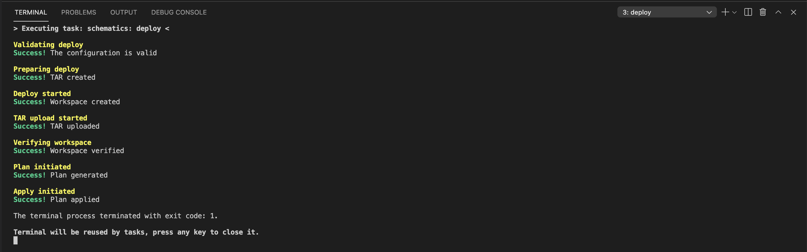
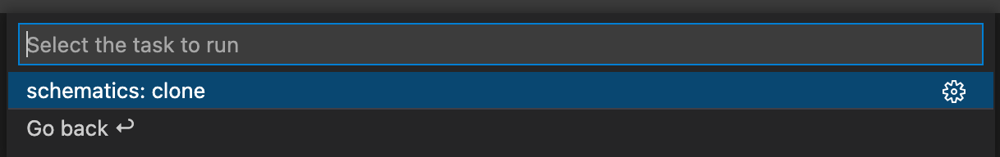
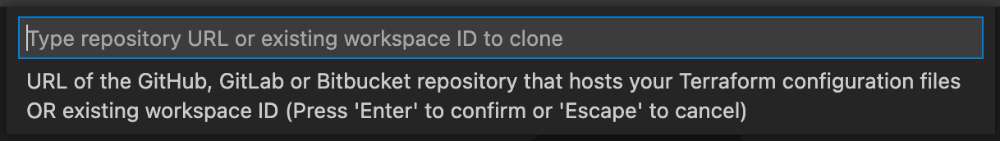
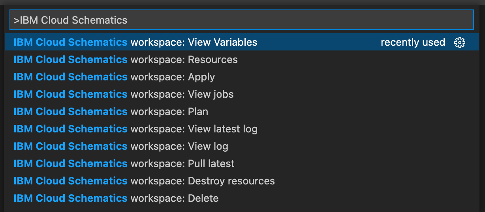

# Visual Studio Code 拡張機能 IBM Cloud Schematics の始め方

※
この内容は [Getting started with IBM Cloud Schematics extension for Visual Studio Code](README.md) を日本語に訳したものです。 

Visual Studio Code 拡張機能 IBM Cloud Schematics は、VS Code エディターからクラウド環境全体の IBM Cloud インフラストラクチャー、サービス、アプリケーション・スタックの自動化を支援します。

**この記事では、以下の方法を紹介します:**

-   VS Code エディタから IBM Cloud Schematics に新しいTerraform テンプレートをデプロイする
-   IBM Cloud から既存の Schematics のワークスペースをクローンする
-   Terraform の Git リポジトリをクローンし、IBM Cloud Schematics にデプロイする
-   VS Code コマンドパレットを使用して、デプロイしたテンプレートに追加タスクを実行する

**前提条件:**

-   Terraform: [Terraform のインストールと設定](https://learn.hashicorp.com/tutorials/terraform/install-cli#install-terraform) – ローカルの開発環境を統合するために Terraform のローカルコピーが必要になります
-   GIT: [GIT CLI のインストール](https://git-scm.com/downloads)
-   Visual Studio Code: お使いのマシン環境に適したビルドの[Visual Studio Code](https://code.visualstudio.com/download) のインストール

## Visual Studio Code 拡張機能 IBM Cloud Schematics のインストール方法

1. GitHub リポジトリの [Releases](https://github.com/IBM-Cloud/vscode-ibmcloud-schematics/releases) へアクセスする
2. Assets セクションで `ibmcloud-schematics-<version>.vsix` というファイルをクリックし、ファイルをダウンロードする。
3. VS Code を起動し、新しいターミナルを開く。
4. VS Code の新しいターミンガルで、次のコマンドを実行する。
 `code --install-extension <2番の手順でダウンロードしたvsixファイルのパスを指定>`

## Visual Studio Code 拡張機能 IBM Cloud Schematics がインストールされていることを確認する方法

1. VS Codeの拡張機能をクリックする。
2. 拡張機能の検索ボックスで “@installed IBM Cloud Schematics” を入力する。
3. インストールされている場合、拡張機能リストに IBM Cloud Schematicsが表示される。

## Tutorial 1: IBM Cloud Schematics 上で新しい Terraform テンプレートを開発、デプロイ、テストする

このチュートリアルでは、IBM Cloud Schematics にデプロイする例として [VPC Classic Cluster](https://github.com/IBM-Cloud/terraform-provider-ibm/tree/master/examples/ibm-cluster/vpc-classic-cluster) を使用しますが、任意の Terraform テンプレートを自由に使用できます。terraform-provider-ibm リポジトリでは、いくつかの有用な例を見つけることができます。

1. Terraform テンプレートを https://github.com/IBM-Cloud/terraform-provider-ibm/tree/master/examples/ibm-cluster/vpc-classic-cluster からダウンロードする。
2. VS Code を起動する。
3. 1番でダウンロードしたテンプレートを [ファイル] メニューの [開く] から開く。
4. [ターミナル] メニューの[タスクの実行]を選択し、実行するタスクのリストを表示する。
5. 実行するタスクの選択ボックスで、`ibmcloud-schematics` を検索する。
   
6. 3つの選択肢が表示される。
7. [ibmcloud-schematics-build] → [schematics: build] の順に選択する。これにより、`Success! The configuration is valid on the terminal` と出力されれば、ローカルマシン上で設定は有効です。
   
8. [ターミナル] → [タスクの実行] から次は [ibmcloud-schematics-deploy] → [schematics: deploy] を選択して実行する。
   
9. デプロイする対象の API を選択する。ここでは cloud.ibm.com を選択する。
   
10. API key を入力する。cloud.ibm.com の API key を入力し、Enterキーを押す。
    
11. ワークスペースの Terraform のバージョンを選択する。ここでは `terraform_v0.12` を選択する。
    
12. ターミナル上でデプロイの進捗状況が出力される。最後に、下記のスクリーンショットのように、デプロイが成功したことを確認する。
    

## Tutorial 2: Schematics ワークスペースで既存の Terraform テンプレートを開発する

既存の Schematics ワークスペースのクローンを作成するには、Schematics workspace ID を使用します。

1. VS Code を起動する。
2. [ターミナル]メニューから[タスクの実行]を選択する。
3. VS Code のタスク検索ボックスで `ibmcloud-schematics` を入力して検索する。
   
4. [ibmcloud-schematics-build] → [schematics:clone] を選択する。
   
5. Schematics workspaceのクローンを作成するフォルダを選択する。
6. 表示されたテキストボックスに、Schematics workspace IDを入力する。
   
7. デプロイする対象の API を選択する。ここでは `cloud.ibm.com` を選択する。
   
8. API keyを入力する。cloud.ibm.com の API key を入力し、Enter キーを押す。
   
9. クローンされた Schematics のワークスペースで新しい VS Code ウィンドウが開く。

## Tutorial 3: IBM Cloud Schematics の Git リポジトリーから既存の Terraform テンプレートを開発する

このチュートリアルでは、VS Code でクローンを作成する例として [VPC Cluster](https://github.com/Cloud-Schematics/vpc-cluster) を使用します。

1. VS Code を開く。
2. [ターミナル]メニューから[タスクの実行]を選択する。
3. 表示されているタスクの検索ボックスで `ibmcloud-schematics` を検索する
4. [ibmcloud-schematics-build] → [schematics:clone] を実行する。
   
5. https://github.com/Cloud-Schematics/vpc-cluster リポジトリのクローンを作成するフォルダを選択する。
6. https://github.com/Cloud-Schematics/vpc-cluster を入力して、Enter キーを押す。
   
7. クローンされた https://github.com/Cloud-Schematics/vpc-cluster で新しい VS Code ウィンドウが開く。
8. [ターミナル] メニューから [タスクの実行] を選択する。
9. タスクの検索ボックスで `ibmcloud-schematics` を検索する。
   
10. [ibmcloud-schematics-build] → [schematics:build] を選択する。これによりTerraformの構成が検証され `Success! The configuration is valid on the terminal` と表示される。
    
11. [ターミナル] メニューから [タスクの実行] を選択する。
12.  [ibmcloud-schematics-deploy] → [schematics:deploy]の順に選択する。
    
13. デプロイするターゲットの API を選択する。ここでは `cloud.ibm.com` を選択する。
    
14. API key を入力する。cloud.ibm.com API key を入力して、Enterキーを押す。
    
15. ワークスペースの Terraform バージョンを選択する。ここでは terraform_v0.12 を選択する。
    
16. ターミナルで進行中の状況が出力される。最後に下記のスクリーンショットのようにデプロイが成功するメッセージが表示されることを確認する。
    

## Tutorial 4: IBM Cloud Schematics 用の VS Code コマンドのパレットを試す

BM Cloud Schematics 拡張機能は、エディターからワークスペース固有のタスクを実行するための追加コマンドを提供します。以下は、この拡張機能が提供するコマンドです:

-   IBM Cloud Schematics workspace: Apply
-   IBM Cloud Schematics workspace: Plan
-   IBM Cloud Schematics workspace: View jobs
-   IBM Cloud Schematics workspace: View log
-   IBM Cloud Schematics workspace: View latest log
-   IBM Cloud Schematics workspace: View resources
-   IBM Cloud Schematics workspace: View variables
-   IBM Cloud Schematics workspace: Pull latest
-   IBM Cloud Schematics workspace: Destroy resources
-   IBM Cloud Schematics workspace: Delete

**プランの適用方法は?**

1. [表示] メニューの [コマンドパレット] を実行する。 (ショートカットキー: ⇧⌘P)
2. “IBM Cloud Schematics” を検索する。
3. [IBM Cloud Schematics workspace: Apply] を選択する。
4. プランが適用される。

**プランの作成方法は?**

1. [表示] メニューの [コマンドパレット] を実行する。 (ショートカットキー: ⇧⌘P)
2. “IBM Cloud Schematics” を検索する。
3. [IBM Cloud Schematics workspace: Plan] を選択する。
4. プランが開始される。

**ワークスペースの Jobs/Activities を表示する方法は?**

1. [表示] メニューの [コマンドパレット] を実行する。 (ショートカットキー: ⇧⌘P)
2. “IBM Cloud Schematics” を検索する。
3. [IBM Cloud Schematics workspace: View jobs] を選択する。
4. 新しいワークスペースの Job WebView が開く。

**ログを見る方法は?**

上記の Workspace Jobs WebView から、View log ボタンを選択して、特定のジョブやアクティビティのログを表示できます。 
また、最新のジョブやアクティビティのログを次の方法で開くこともできます。:

1. [表示] メニューの [コマンドパレット] を実行する。 (ショートカットキー: ⇧⌘P)
2. [IBM Cloud Schematics workspace: View latest log] を選択する。
3. 最新のログが表示された新しい WebView が表示される。

**リソース表示方法は?**

1. [表示] メニューの [コマンドパレット] を実行する。 (ショートカットキー: ⇧⌘P)
2. [IBM Cloud Schematics workspace: View resources] を選択する。
3. リソースを表示した新しい WebView が表示される。

**変数の表示方法とオーバーライドの方法は?**

1. [表示] メニューの [コマンドパレット] を実行する。 (ショートカットキー: ⇧⌘P)
2. [IBM Cloud Schematics workspace: View variables] を選択する。
3. 変数が表示された新しいWebViewが表示される。
4. 変数の値を編集する必要がある場合は、Override テキストボックスに値を入力する。
5. Save variables (変数の保存)ボタンをクリックする。

以上です。