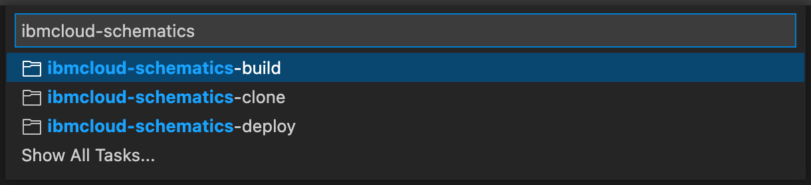
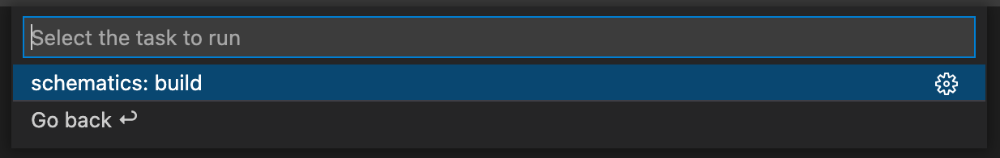
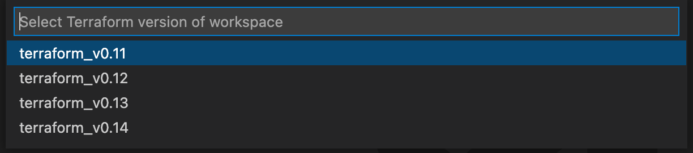
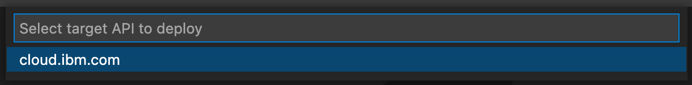
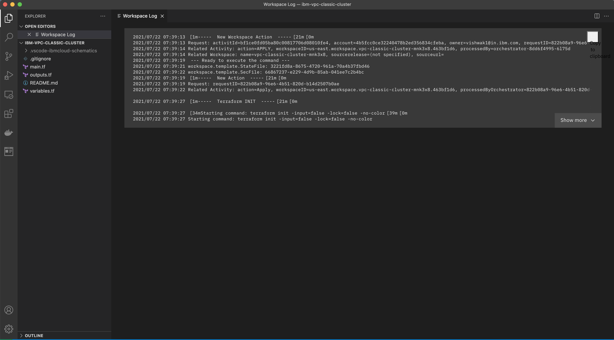
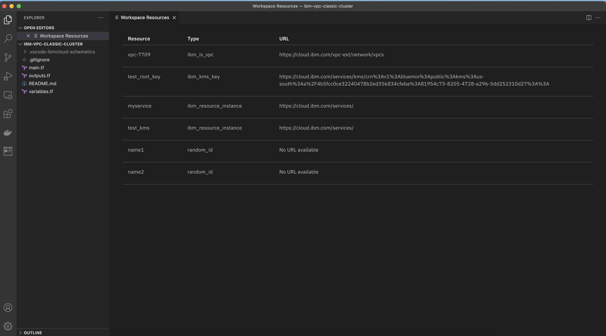
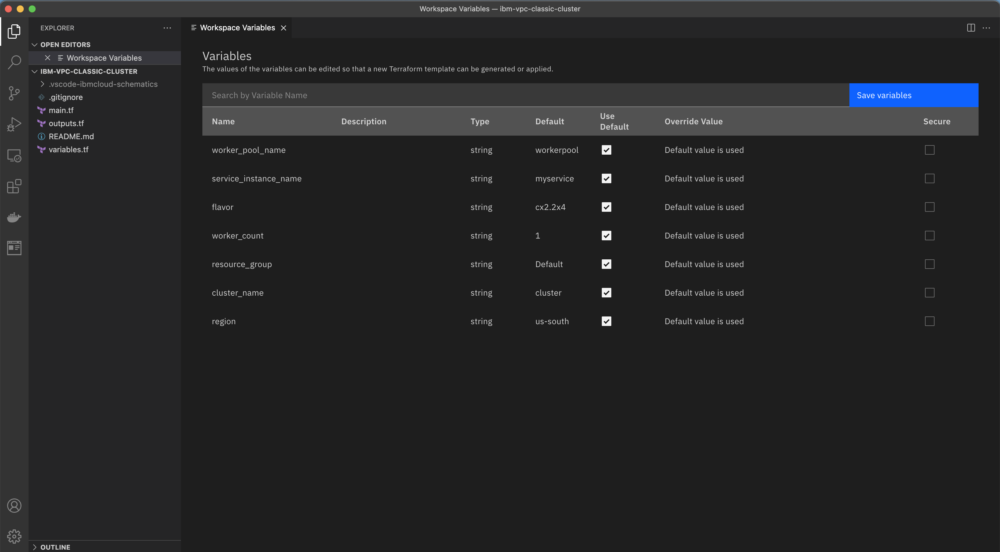

# Visual Studio Code 拡張機能 IBM Cloud Schematics の始め方

Visual Studio Code 拡張機能 IBM Cloud Schematics は、VS Code エディターからクラウド環境全体の IBM Cloud インフラストラクチャー、サービス、アプリケーション・スタックの自動化を支援します。

**この記事では、以下の方法を紹介します:**

-   VS Code エディタから IBM Cloud Schematics に新しいTerraform テンプレートをデプロイする
-   IBM Cloud から既存の Schematics のワークスペースをクローンする
-   Terraform の Git リポジトリをクローンし、IBM Cloud Schematics にデプロイする
-   VS Code コマンドパレットを使用して、デプロイしたテンプレートに追加タスクを実行する

**前提条件:**

-   Terraform: [Terraform のインストールと設定](https://learn.hashicorp.com/tutorials/terraform/install-cli#install-terraform) – ローカルの開発環境を統合するために Terraform のローカルコピーが必要になります
-   GIT: [GIT CLI のインストール](https://git-scm.com/downloads)
-   Visual Studio Code: お使いのマシン環境に適したビルドの[Visual Studio Code](https://code.visualstudio.com/download) のインストール

## Visual Studio Code 拡張機能 IBM Cloud Schematics のインストール方法

1. GitHub リポジトリの [Releases](https://github.com/IBM-Cloud/vscode-ibmcloud-schematics/releases) へアクセスする
2. Assets セクションで `ibmcloud-schematics-<version>.vsix` というファイルをクリックし、ファイルをダウンロードする。
3. VS Code を起動し、新しいターミナルを開く。
4. VS Code の新しいターミンガルで、次のコマンドを実行する。
 `code --install-extension <2番の手順でダウンロードしたvsixファイルのパスを指定>`

## Visual Studio Code 拡張機能 IBM Cloud Schematics がインストールされていることを確認する方法

1. VS Codeの拡張機能をクリックする。
2. 拡張機能の検索ボックスで “@installed IBM Cloud Schematics” を入力する。
3. インストールされている場合、拡張機能リストに IBM Cloud Schematicsが表示される。

## Tutorial 1: IBM Cloud Schematics 上で新しい Terraform テンプレートを繰り返し開発、デプロイ、テストする

For the sake of this tutorial, I we will use [VPC Classic Cluster](https://github.com/IBM-Cloud/terraform-provider-ibm/tree/master/examples/ibm-cluster/vpc-classic-cluster) as an example to deploy to IBM Cloud Schematics, but you are free to use any Terraform template. You can find some useful examples in the on terraform-provider-ibm repository.

1. Download the terraform template from https://github.com/IBM-Cloud/terraform-provider-ibm/tree/master/examples/ibm-cluster/vpc-classic-cluster to your machine
2. Launch Visual Studio Code
3. Open the downloaded template from step one into editor from File > Open...
4. Select Terminal > Run Task... , this will open VS Code Tasks dropdown
5. In the VS Code Tasks search text box , search for `ibmcloud-schematics`
   
6. You will see 3 tasks as in above image
7. Select ibmcloud-schematics-build > schematics: build. This will validate the terraform configuration and output `Success! The configuration is valid on the terminal`
   
8. Select Terminal > Run Task... now select ibmcloud-schematics-deploy > schematics: deploy from the dropdown
   
9. Select target API to deploy. Here select cloud.ibm.com from the picker
   
10. Enter API key. Type in your cloud.ibm.com API key and hit enter
    
11. Select Terraform version of workspace. Here select `terraform_v0.12`
    
12. You can see the deployment progress on the terminal. Finally you should be seeing successful deploy as in below screenshot
    

## Tutorial 2: Schematics ワークスペースで既存の Terraform テンプレートを繰り返し開発する

You can clone your existing Schematics workspace using the Schematics workspace ID.

1. Launch Visual Studio Code
2. Select Terminal > Run Task... , this will open VS Code Tasks dropdown
3. In the VS Code Tasks search text box , search for `ibmcloud-schematics`
   
4. Select ibmcloud-schematics-build > schematics:clone
   
5. Select the folder where you want to clone Schematics workspace
6. Type the Schematics workspace ID in the displayed text box
   
7. Select target API to deploy. Here select cloud.ibm.com from the picker
   
8. Enter the API key. Type in your cloud.ibm.com API key and hit enter
   
9. A new VS Code window will open with the cloned Schematics workspace

## Tutorial 3: IBM Cloud Schematics の Git リポジトリーから既存の Terraform テンプレートを繰り返し開発

For sake of this tutorial, I will use [VPC Cluster](https://github.com/Cloud-Schematics/vpc-cluster) as an example to clone in VS Code

1. Launch Visual Studio Code
2. Select Terminal > Run Task... , this will open VS Code Tasks dropdown
3. In the VS Code Tasks search text box , search for “ibmcloud-schematics”
4. Select ibmcloud-schematics-build > schematics:clone
   
5. Select the folder where you want to clone https://github.com/Cloud-Schematics/vpc-cluster
6. Enter https://github.com/Cloud-Schematics/vpc-cluster and hit enter
   
7. A new VS Code window will open with the cloned https://github.com/Cloud-Schematics/vpc-cluster
8. Select Terminal > Run Task... , this will open VS Code Tasks dropdown
9. In the VS Code Tasks search text box , search for “ibmcloud-schematics”
   
10. Select ibmcloud-schematics-build > schematics:build. This will validate the terraform configuration and output “Success! The configuration is valid on the terminal”
    
11. Select Terminal > Run Task... now select ibmcloud-schematics-deploy > schematics:deploy from the dropdown
    
12. Select target API to deploy. Here select cloud.ibm.com from the picker
    
13. Enter API key. Type in your cloud.ibm.com API key and hit enter
    
14. Select Terraform version of workspace. Here select terraform_v0.12
    
15. You can see the deployment progress on the terminal. Finally you should be seeing a successful deploy as in below screenshot
    

## Tutorial 4: IBM Cloud Schematics 用の VS Code コマンドのパレットを試す

The IBM Cloud Schematics extension provides additional commands that can be executed to perform workspace specific tasks from editor. Below are the commands provided by the extension:

-   IBM Cloud Schematics workspace: Apply
-   IBM Cloud Schematics workspace: Plan
-   IBM Cloud Schematics workspace: View jobs
-   IBM Cloud Schematics workspace: View log
-   IBM Cloud Schematics workspace: View latest log
-   IBM Cloud Schematics workspace: View resources
-   IBM Cloud Schematics workspace: View variables
-   IBM Cloud Schematics workspace: Pull latest
-   IBM Cloud Schematics workspace: Destroy resources
-   IBM Cloud Schematics workspace: Delete

**How to apply plan?**

1. Select View > Command Palette... from VS Code menu bar ( Keyboard Shortcut: ⇧⌘P )
2. Search for “IBM Cloud Schematics”
3. Select IBM Cloud Schematics workspace: Apply
4. Apply initiated

**How to generate plan?**

1. Select View > Command Palette... from VS Code menu bar ( Keyboard Shortcut: ⇧⌘P )
2. Search for “IBM Cloud Schematics”
3. Select IBM Cloud Schematics workspace: Plan
4. Plan initiated

**How to view workspace Jobs/Activities?**

1. Select View > Command Palette... from VS Code menu bar ( Keyboard Shortcut: ⇧⌘P )
2. Search for “IBM Cloud Schematics”
3. Select IBM Cloud Schematics workspace: View jobs
4. A new Workspace jobs WebView is opened

**How to view logs?**

From the above Workspace Jobs WebView , you can select View log button to view the log of a specific job or activity. 
You can also open the latest job/activity log by:

1. Select View > Command Palette... from VS Code menu bar ( Keyboard Shortcut: ⇧⌘P )
2. Select IBM Cloud Schematics workspace: View latest log
3. A new WebView with latest log is displayed

**How to view resources?**

1. Select View > Command Palette... from VS Code menu bar ( Keyboard Shortcut: ⇧⌘P )
2. Select IBM Cloud Schematics workspace: View resources
3. A new WebView with resources is displayed

**How to view and override Variables?**

1. Select View > Command Palette... from VS Code menu bar ( Keyboard Shortcut: ⇧⌘P )
2. Select IBM Cloud Schematics workspace: View variables
3. A new WebView with variables is displayed
4. If you need to edit a variable value, enter value in Override textbox
5. Click on Save variables button

